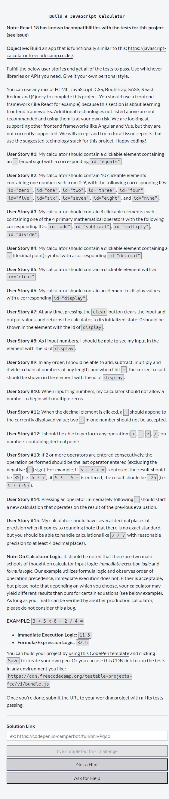
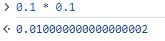

# Project JavaScript Calculator

Repositorio con el código con el cual he creado mi calculadora para aprobar el **cuarto proyecto** que es requisito obligatorio para obtener la **Front End Development Libraries Certification** de [freecodecamp](https://www.freecodecamp.org/learn/front-end-development-libraries/front-end-development-libraries-projects/build-a-javascript-calculator). En mi proyecto he incluido la test suite de freecodecamp para verificar la aprobación de mi proyecto.

Nota: en algunos navegadores y dispositivos ocurre que al realizar los test se genera un desfase entre el valor almacenado en el elemento con id='display' lo que puede generar en ocasiones que mi proyecto falle en algunos test debido al re-rendereo del componente.

## Descripción

He creado una calculadora que realiza las operaciones aritméticas **suma**, **resta**, **multiplicación** y **división** con una precisión de 10 digitos. La calculadora posee botones para el ingreso de digitos del 0 al 9, botón para agregar un punto, botón para volver al estado inicial (borra todo), botones de las 4 operaciones matemáticas y botón para realizar los cálculos. Además, como auto desafío, he creado los botones: agregar dos ceros (**00**), obtener porcentaje (**%**) y borrar el último caracter ingresado **<-**. Estos tres botones adicionales estan fuera de los requisitos obligatorios que debía cumplir el proyecto.

## Librerias Utilizadas

| Tecnologías Utilizadas |
| ---------------------- |
| Nextjs 12              |
| React 17               |
| ReactDom 17            |
| Mathjs                 |
| React-icons            |
| Typewriter-effect      |

## Requisitos del Proyecto

## Proyecto Aprobado al superar todos los test

## Screenshot Devices

### Pantallas Grandes

### Pantallas Small

## Operaciones

A continuación muestro una serie de operaciones matemáticas que usando JavaScript puro darían error debido al uso de números de punto flotante pero que mi calculadora realiza correctamente al manejar los números como BigNumber de la librería **Mathjs**:

### 1.. 0.1+0.2

#### 1.1.. 0.1+0.2 en Javascript Puro

#### 1.2.. 0.1+0.2 en mi calculadora

### 2.. 0.3-0.1

#### 2.1.. 0.3-0.1 en Javascript Puro

#### 2.2.. 0.3-0.1 en mi calculadora

### 3.. 0.7 \* 0.1

#### 3.1.. 0.7 \* 0.1 en Javascript Puro

#### 3.2.. 0.7 \* 0.1 en mi calculadora

### 4.. 0.2+0.1-0.3

#### 4.1.. 0.2+0.1-0.3 en Javascript Puro

#### 4.2.. 0.2+0.1-0.3 en mi calculadora

### 5.. 0.1\*0.1

#### 5.1.. 0.1\*0.1 en Javascript Puro

#### 5.2.. 0.1\*0.1 en mi calculadora

### 6.. 0.3+0.6

#### 6.1.. 0.3+0.6 en Javascript Puro

#### 6.2.. 0.3+0.6 en mi calculadora

### 7.. 0.3 \* 0.3 / 0.1

#### 7.1.. 0.3 \* 0.3 / 0.1 en Javascript Puro

#### 7.2.. 0.3 \* 0.3 / 0.1 en mi calculadora

